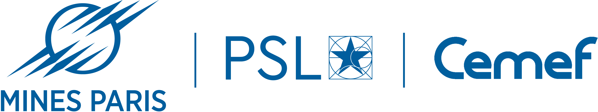

# Deep Learning Prediction of Dry Friction in DLC Coatings Using Literature-Derived Data

## Overview

This repository showcases a machine learning pipeline described in the article "Deep Learning Prediction of Dry Friction in DLC Coatings Using Literature-Derived Data" [https://doi.org/10.1007/s11249-025-02056-2](https://doi.org/10.1007/s11249-025-02056-2) , including:
- Data preprocessing
- Training multiple models (Random Forest, Extra trees, XGBoost, SVM, KNN,ANN with tensorflow)
- Performance evaluation (RMSE,MAE,R²)
- Interpretability with SHAP
- Visualization of the results

⚠️ **A reduced sample dataset is provided in the repository to reproduce the methodology**

The repository is organised as follows:
- 'Data/': DLC dataset ([Download the dataset](./Data/Cherguy___al_DLC_dataset.xlsx))
- 'Script/TriboAI_pipeline_demo.py': main executable script
- 'Results/': generated metrics and figures
- 'Trained models/': trained models ('.h5')
- 'Docs/': additional documents and logos
- 'requirements.txt': python dependencies

---

## Usage

1. **Install dependencies**
   
   >pip install -r requirements.txt

2. **Run the pipeline**
3. **Generated outputs**
- metrics
- figures
4. **Use pretrained models**
- Trained models are available for direct use

---

## Citation
If you use this repository, please cite the following article:

> Cherguy, O., Chmielowski, R., Hachem, E., & Lahouij, I. (2025).  
> *Deep Learning Prediction of Dry Friction in DLC Coatings Using Literature-Derived Data*.  
> Tribology Letters, 73, Article 125.  
> [https://doi.org/10.1007/s11249-025-02056-2](https://doi.org/10.1007/s11249-025-02056-2)  
> [Read online (Springer)](https://link.springer.com/article/10.1007/s11249-025-02056-2)

---

## Acknowledgment
The team is grateful to **Pierre Montmitonnet** for his valuable insights and advices on the construction of the dataset and the normalization of the tribological data.

This work is supported by Mines Paris-PSL (CEMEF), IMRA Europe and Fondation de la Maison de la Chimie

  
  
  

---

## Team and contacts

| Name                     | Affiliation                 | LinkedIn                                                             | GitHub                                |
| ------------------------ | --------------------------- | -------------------------------------------------------------------- | ------------------------------------- |
| **Oussama Cherguy**      | **Mines Paris-PSL – CEMEF** | [LinkedIn](https://www.linkedin.com/in/oussama-c-10a695136/)         | [GitHub](https://github.com/ocherguy) |
| **Radoslaw Chmielowski** | **IMRA Europe**             | [LinkedIn](https://www.linkedin.com/in/rchmielowski/)                | —                                     |
| **Elie Hachem**          | **Mines Paris–PSL - CEMEF** | [LinkedIn](https://www.linkedin.com/in/ehachem/)                     | —                                     |
| **Imène Lahouij**        | **Mines Paris-PSL – CEMEF** | [LinkedIn](https://www.linkedin.com/in/im%C3%A8ne-lahouij-75833a54/) | —                                     |
